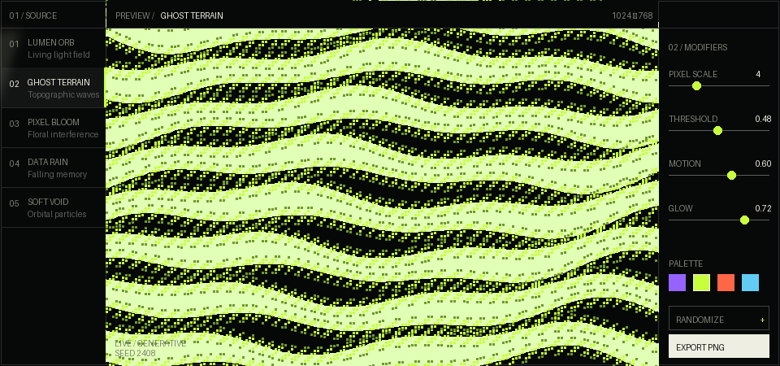

  

Hi, I'm Moghees. I build mobile apps, terminal tools, and web projects.

### Projects

- **[Kagari](https://github.com/mogheess/kagari)** — a modern manga and manhwa reader for Android, built around a clean local-first experience.
- **[Awqat CLI](https://github.com/mogheess/awqat-cli)** — Islamic prayer times for your city, directly from the terminal.
### Tools

`Python` · `JavaScript` · `React` · `Next.js` · `Supabase` · `Docker`

  <a href="https://www.linkedin.com/in/m0ghees">LinkedIn</a> &nbsp;·&nbsp;
  <a href="https://twitter.com/zdstack">X / Twitter</a>

