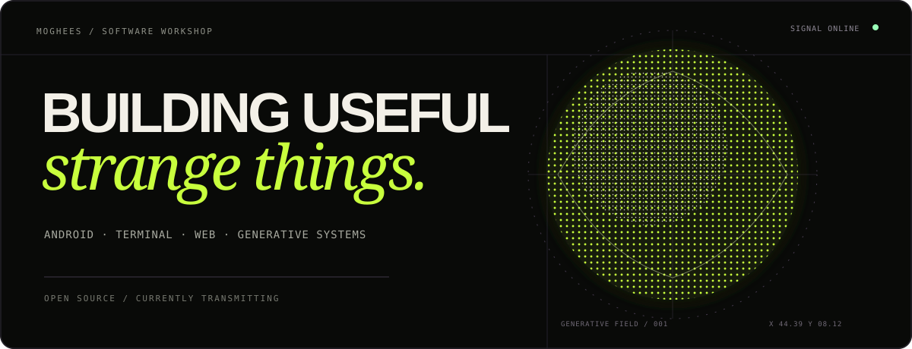
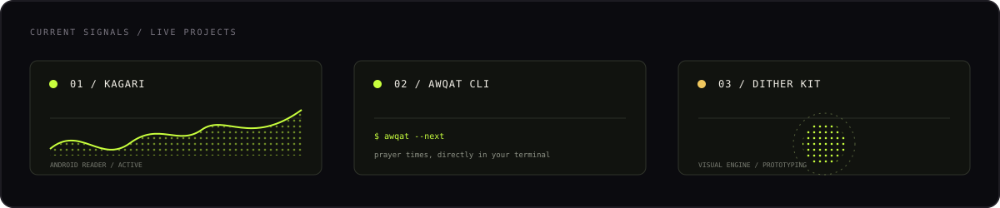

  

  <code>android</code>&nbsp;&nbsp;·&nbsp;&nbsp;<code>terminal tools</code>&nbsp;&nbsp;·&nbsp;&nbsp;<code>generative systems</code>&nbsp;&nbsp;·&nbsp;&nbsp;<code>full-stack</code>

 

I make focused software with personality: an Android reader, small terminal tools, and visual experiments that make the web feel less interchangeable.

 

  

### Selected transmissions

- **[Kagari](https://github.com/mogheess/kagari)** — a modern manga and manhwa reader for Android, built around a clean local-first experience.
- **[Awqat CLI](https://github.com/mogheess/awqat-cli)** — Islamic prayer times for your city, directly from the terminal.
- **Dither Kit** — an experimental visual engine for patterns, images, type, motion, and data.

### Working with

`Python` · `JavaScript` · `React` · `Next.js` · `Supabase` · `Docker`

  <a href="https://www.linkedin.com/in/m0ghees">LinkedIn</a> &nbsp;·&nbsp;
  <a href="https://twitter.com/zdstack">X / Twitter</a>

SIGNAL END / THANKS FOR VISITING

