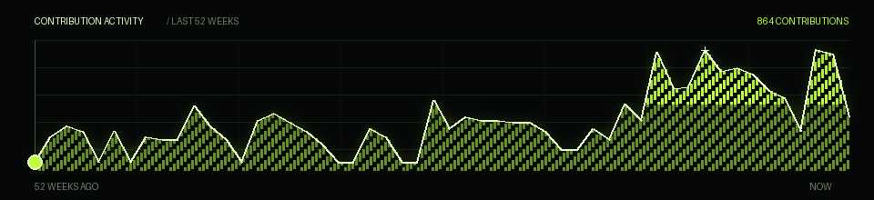

<h1 align="center">Hi there, I'm Mogheess! 👋</h1>
<h3 align="center">Learning different technologies</h3>

---

  

---

### 👩‍💻 About Me:
- 🌱 I’m currently learning **Generative AI and Mobile Development**
- 💬 Ask me about **Fullstack Development**
- 🚀 I’m working on **a small side project**

---

### Activity

  

---

### 🛠️ Skills & Tools:

  
  
  
  
  
  
  

---

### 🌐 Connect with Me:

  
  

